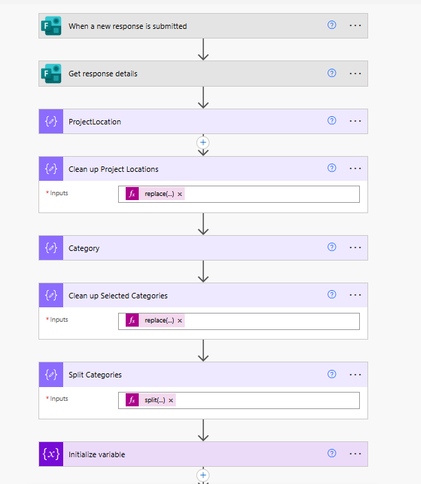
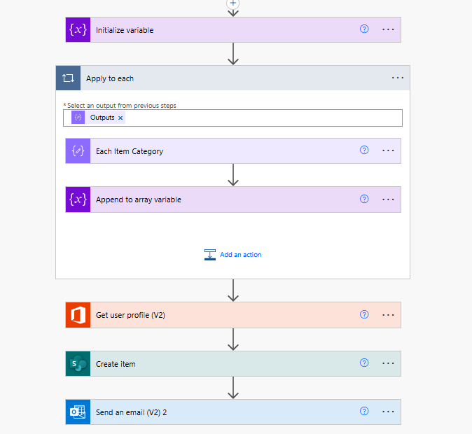

# 📥 Project Submission Flow (Power Automate)

## 📄 Overview

This repository contains a Power Automate workflow designed to **capture and register project submissions** made through Microsoft Forms.

It automates the intake, validation, storage, and notification processes, enabling organizations to streamline how they collect and act on internal project ideas or initiatives.

---

## 🧩 Key Features

- 🔗 Integrates directly with Microsoft Forms
- 📋 Parses and validates form responses
- 💾 Saves submissions to SharePoint or Dataverse
- 📬 Sends automated email confirmations
- 🧑‍💼 Can trigger review or approval workflows
- 📈 Ready for integration with Power BI dashboards

---

## 📂 Project Structure

```text
project-submission-flow/
├── README.md
├── Flow/
│   ├── ProjectSubmissionFlow.zip
│   └── flow-diagram.png
├── docs/
│   └── screenshots/
│       ├── submission-form.png
│       └── flow-overview.png
```

---

## 🚀 How to Use

1. Visit [https://make.powerautomate.com](https://make.powerautomate.com)
2. Select **Import > Import Package (.zip)**
3. Upload `Flow/ProjectSubmissionFlow.zip`
4. Reconnect necessary connectors (Microsoft Forms, Outlook, SharePoint, etc.)
5. Customize field mappings and email templates if needed
6. Save and activate the flow

---

## 📸 Screenshots

| Flow Overview 1 | Flow Overview 2 |
|----------------|---------------|
|  |  |

---

## 👤 Author

Developed by [Tiago Freitas](https://www.linkedin.com/in/tiagosfreitas/)  
💼 Power Platform & .NET Developer with 15+ years of experience in enterprise automation, cloud systems, and business solutions.

📂 View more projects: [https://github.com/freitasts365](https://github.com/freitasts365)

---

## 📄 License

This project is provided for demonstration and internal automation purposes.  
Feel free to modify and adapt it to your organizational needs.
